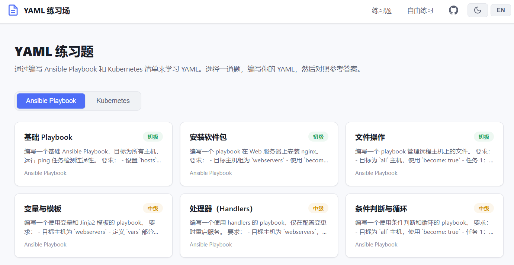

# infra-lab

A web-based interactive YAML practice platform for beginners, covering **Ansible Playbook** and **Kubernetes** manifests.

[English](#features) | [中文说明](#中文说明)

## Features

- **Monaco Editor** — Same editor as VS Code, with YAML syntax highlighting and auto-indentation
- **12 Exercises** — 6 Ansible Playbook + 6 Kubernetes, from beginner to intermediate
- **Real-time Validation** — Syntax checking with line-level error reporting and structural checks
- **Answer Comparison** — Side-by-side diff view against reference answers
- **Progress Tracking** — Completed exercises saved locally in browser
- **Free Practice (Sandbox)** — Write any YAML freely with syntax-only validation, no exercises or answers
- **Light / Dark Theme** — Default light mode with one-click dark mode toggle, preference saved locally
- **i18n** — Chinese / English UI switch, auto-detects browser language
- **One-Click Start** — `.bat` for Windows, `.sh` for Linux, or Docker; auto-detects network and switches to China npm mirror if needed

## Quick Start

### Option 1: Windows (double-click) — Recommended

> Requires [Node.js](https://nodejs.org/) (v18+). If not installed, the script will prompt you.

**First time:**

1. Double-click **`start.bat`**
2. Wait for automatic dependency installation and build (first time only, takes 1-2 minutes)
3. Browser opens automatically to http://localhost:3000

**Next time:**

1. Double-click **`start.bat`** again — skips install/build, starts in seconds
2. Browser opens automatically

**To stop:** Close the command prompt window.

### Option 2: Linux / macOS

```bash
# First time
chmod +x install.sh
./install.sh

# Next time — just run it again
./install.sh
```

Browser opens automatically. Press `Ctrl+C` to stop.

### Option 3: npm

```bash
# First time — install dependencies
npm run install:all

# Start (builds frontend + starts server on port 3000)
npm start

# Next time — just run npm start again
npm start
```

Open http://localhost:3000 in your browser. Press `Ctrl+C` to stop.

### Option 4: Docker

```bash
# Start
docker compose up -d

# Stop
docker compose down
```

Open http://localhost:3000.

## Screenshots


## Exercises

### Ansible Playbook

| # | Title | Difficulty |
|---|-------|-----------|
| 1 | Basic Playbook | Beginner |
| 2 | Package Install | Beginner |
| 3 | File Operations | Beginner |
| 4 | Variables & Templates | Intermediate |
| 5 | Handlers | Intermediate |
| 6 | Conditionals & Loops | Intermediate |

### Kubernetes

| # | Title | Difficulty |
|---|-------|-----------|
| 1 | Pod | Beginner |
| 2 | Deployment | Beginner |
| 3 | Service | Beginner |
| 4 | ConfigMap & Secret | Intermediate |
| 5 | PersistentVolumeClaim | Intermediate |
| 6 | Ingress | Intermediate |

## Tech Stack

| Layer | Technology |
|-------|-----------|
| Frontend | React 18 + Vite 8 + Monaco Editor |
| Backend | Node.js + Express |
| Validation | js-yaml (syntax + structural checks) |
| Diff View | react-diff-viewer-continued |
| Security | helmet, CORS, input size limits |
| i18n | React Context + locale files |

## Project Structure

```
infra-lab/
├── start.bat                    # Windows one-click start
├── install.sh                   # Linux/macOS install & start
├── Dockerfile / docker-compose.yml
├── package.json                 # Root scripts
├── client/                      # React frontend (Vite)
│   ├── src/
│   │   ├── components/          # Header, YamlEditor, ExerciseList, DiffViewer
│   │   ├── pages/               # Home, Exercise, Sandbox, NotFound
│   │   ├── hooks/               # useExercises (shared data hook)
│   │   └── i18n/                # I18nContext, en.js, zh.js
│   └── vite.config.js
└── server/                      # Express backend
    ├── app.js                   # Entry point (also serves built frontend)
    ├── routes/
    │   ├── exercises.js         # Exercise CRUD + answer checking
    │   └── validate.js          # YAML validation
    └── data/
        └── exercises.json       # All exercises (en + zh)
```

## API

| Method | Endpoint | Description |
|--------|----------|-------------|
| GET | `/api/exercises?lang=en` | List all exercises by category |
| GET | `/api/exercises/:id?lang=zh` | Get exercise detail |
| POST | `/api/validate` | Validate YAML syntax + structure |
| POST | `/api/exercises/:id/check` | Check answer correctness |

## Development

```bash
# Install dependencies
npm run install:all

# Start dev servers (frontend :5173 + backend :3001, hot-reload)
npm run dev

# Build frontend only
npm run build
```

## Adding Exercises

Edit `server/data/exercises.json`. Each exercise has:

```json
{
  "id": "unique-id",
  "category": "playbook | k8s",
  "title": "English Title",
  "title_zh": "中文标题",
  "difficulty": "beginner | intermediate",
  "description": "English description...",
  "description_zh": "中文描述...",
  "template": "starter YAML template",
  "answer": "reference answer YAML"
}
```

Restart the server after editing.

## License

MIT

---

## 中文说明

一个面向初学者的 Web 端 YAML 交互式练习平台，涵盖 **Ansible Playbook** 和 **Kubernetes** 两大类。

### 界面预览



### 功能特性

- **Monaco 编辑器** — 与 VS Code 相同的编辑器，支持 YAML 语法高亮和自动缩进
- **12 道练习题** — 6 道 Ansible Playbook + 6 道 Kubernetes，从初级到中级
- **实时校验** — 语法检查，精确到行号的错误提示，以及结构性检查
- **答案对比** — 提交后与参考答案的并排差异对比
- **进度追踪** — 已完成的练习保存在浏览器本地
- **自由练习（沙箱）** — 自由编写任意 YAML，仅做语法校验，无题目无答案
- **亮色 / 暗色主题** — 默认亮色，一键切换暗色模式，偏好本地保存
- **中英文切换** — 支持中文 / 英文界面切换，自动检测浏览器语言
- **一键启动** — Windows 双击 `.bat`，Linux 运行 `.sh`，或使用 Docker；自动检测网络，国内自动切换淘宝镜像源

### 快速开始

#### 方式一：Windows 双击启动（推荐）

> 需要先安装 [Node.js](https://nodejs.org/)（v18 以上），没装的话脚本会提示。

**首次使用：**

1. 双击 **`start.bat`**
2. 等待自动安装依赖和构建（仅首次，约 1-2 分钟）
3. 浏览器自动打开 http://localhost:3000

**再次使用：**

1. 双击 **`start.bat`** — 跳过安装和构建，秒启动
2. 浏览器自动打开

**停止服务：** 关闭命令提示符窗口即可。

#### 方式二：Linux / macOS

```bash
# 首次使用
chmod +x install.sh
./install.sh

# 再次使用 — 直接运行
./install.sh
```

浏览器自动打开。按 `Ctrl+C` 停止。

#### 方式三：npm 命令

```bash
# 首次使用 — 安装依赖
npm run install:all

# 启动（构建前端 + 启动服务器，端口 3000）
npm start

# 再次使用 — 直接 npm start
npm start
```

浏览器打开 http://localhost:3000 。按 `Ctrl+C` 停止。

#### 方式四：Docker

```bash
# 启动
docker compose up -d

# 停止
docker compose down
```

浏览器打开 http://localhost:3000

### 添加练习题

编辑 `server/data/exercises.json`，按照现有格式添加即可。每道题包含中英文标题和描述。修改后重启服务器生效。
