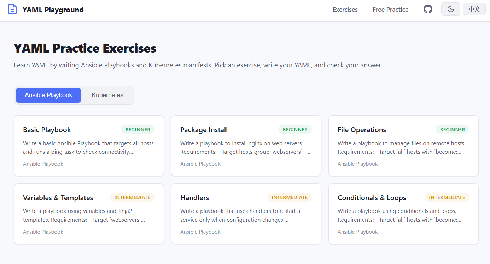

# infra-lab

A web-based interactive YAML practice platform for beginners, covering **Ansible Playbook** and **Kubernetes** manifests.

[English](README.md) | [中文](README_ZH.md)

## Screenshots



## Features

- **Monaco Editor** — Same editor as VS Code, with YAML syntax highlighting and auto-indentation
- **12 Exercises** — 6 Ansible Playbook + 6 Kubernetes, from beginner to intermediate
- **Real-time Validation** — Syntax checking with line-level error reporting and structural checks
- **Answer Comparison** — Side-by-side diff view against reference answers
- **Progress Tracking** — Completed exercises saved locally in browser
- **Free Practice (Sandbox)** — Write any YAML freely with syntax-only validation, no exercises or answers
- **Light / Dark Theme** — Default light mode with one-click dark mode toggle, preference saved locally
- **i18n** — Chinese / English UI switch, auto-detects browser language
- **One-Click Start** — `.bat` for Windows, `.sh` for Linux, or Docker; auto-detects network and switches to China npm mirror if needed

## Quick Start

### Option 1: Windows (double-click) — Recommended

> Requires [Node.js](https://nodejs.org/) (v18+). If not installed, the script will prompt you.

**First time:**

1. Double-click **`start.bat`**
2. Wait for automatic dependency installation and build (first time only, takes 1-2 minutes)
3. Browser opens automatically to http://localhost:3000

**Next time:**

1. Double-click **`start.bat`** again — skips install/build, starts in seconds
2. Browser opens automatically

**To stop:** Close the command prompt window.

### Option 2: Linux / macOS

```bash
chmod +x install.sh
./install.sh
```

Browser opens automatically. Press `Ctrl+C` to stop.

### Option 3: npm

```bash
npm run install:all
npm start
```

Open http://localhost:3000 in your browser. Press `Ctrl+C` to stop.

### Option 4: Docker

```bash
docker compose up -d
docker compose down
```

Open http://localhost:3000.

## Exercises

### Ansible Playbook

| # | Title | Difficulty |
|---|-------|-----------|
| 1 | Basic Playbook | Beginner |
| 2 | Package Install | Beginner |
| 3 | File Operations | Beginner |
| 4 | Variables & Templates | Intermediate |
| 5 | Handlers | Intermediate |
| 6 | Conditionals & Loops | Intermediate |

### Kubernetes

| # | Title | Difficulty |
|---|-------|-----------|
| 1 | Pod | Beginner |
| 2 | Deployment | Beginner |
| 3 | Service | Beginner |
| 4 | ConfigMap & Secret | Intermediate |
| 5 | PersistentVolumeClaim | Intermediate |
| 6 | Ingress | Intermediate |

## Tech Stack

| Layer | Technology |
|-------|-----------|
| Frontend | React 18 + Vite 8 + Monaco Editor |
| Backend | Node.js + Express |
| Validation | js-yaml (syntax + structural checks) |
| Diff View | react-diff-viewer-continued |
| Security | helmet, CORS, input size limits |
| i18n | React Context + locale files |

## Project Structure

```
infra-lab/
├── start.bat
├── install.sh
├── Dockerfile / docker-compose.yml
├── package.json
├── client/
│   ├── src/
│   │   ├── components/
│   │   ├── pages/
│   │   ├── hooks/
│   │   └── i18n/
│   └── vite.config.js
└── server/
    ├── app.js
    ├── routes/
    │   ├── exercises.js
    │   └── validate.js
    └── data/
        └── exercises.json
```

## API

| Method | Endpoint | Description |
|--------|----------|-------------|
| GET | `/api/exercises?lang=en` | List all exercises by category |
| GET | `/api/exercises/:id?lang=zh` | Get exercise detail |
| POST | `/api/validate` | Validate YAML syntax + structure |
| POST | `/api/exercises/:id/check` | Check answer correctness |

## Development

```bash
npm run install:all
npm run dev
```

## Adding Exercises

Edit `server/data/exercises.json`. 


Restart the server after editing.
